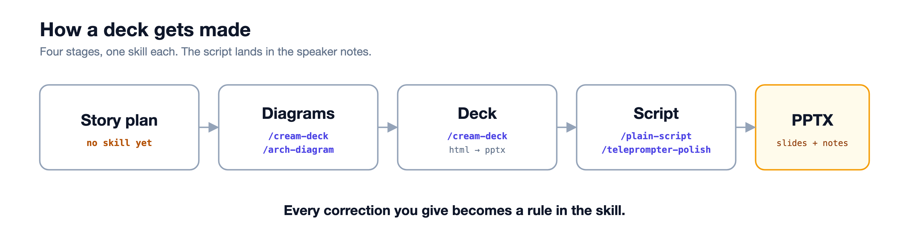

# creator-skills

Seven Claude Code skills for making technical presentations and explainer videos:
diagrams, decks, scripts, and b-roll. Every deck goes through the same four stages,
one skill each, and the script lands in the speaker notes of the PPTX.



The full picture with the optional skills is [docs/pipeline-full.png](docs/pipeline-full.png).

## The skills

| Skill | Stage | What it does |
|---|---|---|
| `arch-diagram` | diagrams | white blog-style technical diagram (architecture, flow, loop). Hand-authored SVG rendered to PNG at 2× with headless Chrome. Reads the code first: every box is a name in the repo |
| `cream-deck` | diagrams · deck · export | the cream/felt 课件 system: sparse diagrams (a name and one sub per box), the HTML deck (1600×900, slide types, deep links, per-slide screenshots), and the PPTX pipeline that reads the real geometry out of the browser and writes editable + flat files with the talk track as speaker notes |
| `plain-script` | script | the talk track a 16-year-old can follow: one row per slide (Say · On screen · Sec), the real term first, question before answer, a terms table as the gate |
| `teleprompter-polish` | script | the read-aloud pass: short spoken lines, plain text, facts untouched |
| `script-doctor` | script (video) | retention pass for YouTube scripts: hook, pacing, cut points, open loops |
| `google-brand-deck` | export | HTML deck → editable PPTX in the Google Brand visual system |
| `mma-animation` | video | script → seekable HTML timeline → 5K MP4 master + per-scene clips + manifest, seven themes |

Not here yet: a `story-plan` skill (today a convention: acts, one line each, in the order you
teach) and a `hero-art` skill (the Nano Banana recipe: one chat session seeded with reference
images so a deck's art matches).

## Install

```
git clone https://github.com/cuppibla/creator-skills
./creator-skills/install.sh user
```

`user` copies the skills to `~/.claude/skills`; `local` copies them to `./.claude/skills` of the
current repo. Start a new Claude Code session afterwards. The `SKILL.md` format is read by other
coding agents too; check yours.

Rendering needs Google Chrome on macOS (`/Applications/Google Chrome.app`), `python3` with
`Pillow` and `python-pptx`, and Node for `mma-animation` (`npm install` in its `scripts/`, which
the installer runs when `npm` is present).

## How to use it on a topic

1. Write the story plan with the agent: the acts, one line each, in the order you teach
   (why → what it is → take it apart → what it replaced → diagram + code → tradeoff).
2. Ask for the diagrams. The skill reads the code, draws SVG, renders PNG, looks at every PNG
   at full size, and fixes it before showing you.
3. Ask for the deck. Review the screenshot grids, not the browser.
4. Ask for the script (`plain-script`), then the read-aloud pass (`teleprompter-polish`).
5. `python3 tools/build_pptx.py` in the deck folder writes both PPTX files with the notes in.

## The loop that makes it yours

Your first deck will not match your taste. Say so, in plain words ("too dense, big direction
only"). Then ask the agent to write the correction into the skill's `SKILL.md`. The rules in
`cream-deck` are eight such corrections from one deck. After three or four decks the skill is yours.

## Layout

```
skills/<name>/SKILL.md     the rules, the paint, the workflow
skills/<name>/assets/      kits, templates, icons, scripts
docs/                      the pipeline diagrams (svg + png)
install.sh                 user | local
```
